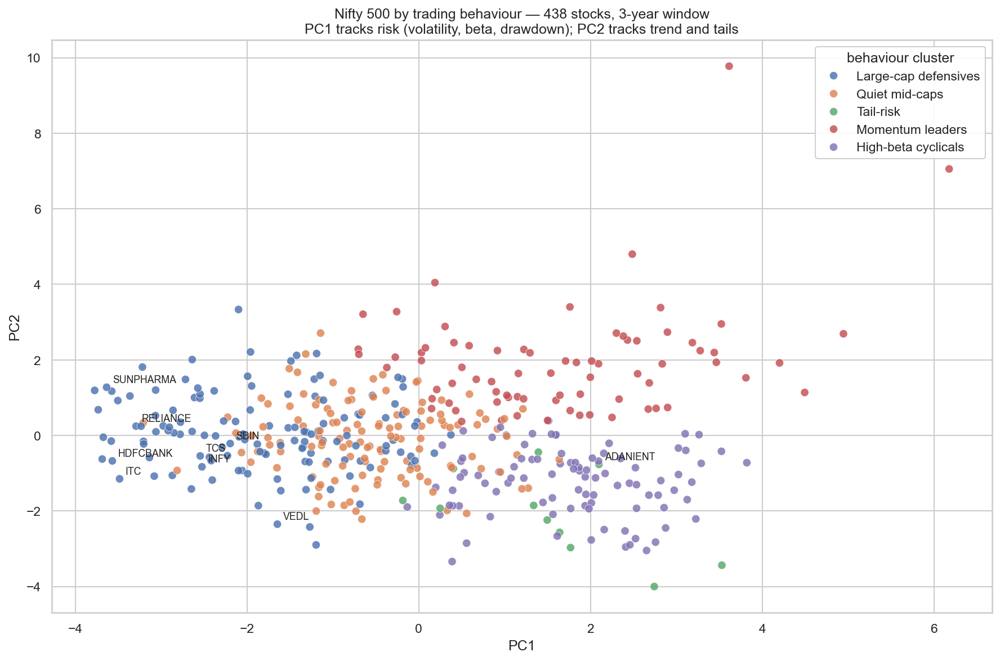
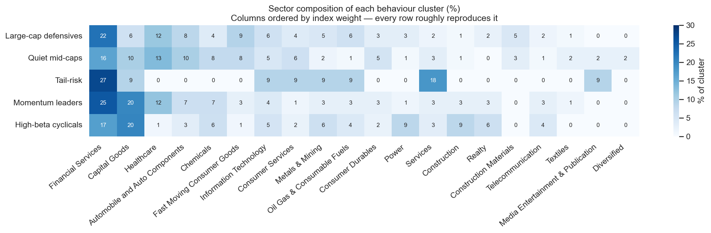

# Nifty 500 Behaviour Clusters

**An automated NSE market-data pipeline that maintains a 527k-row daily OHLCV dataset for the Nifty 500, and clusters those stocks by how they *behave* rather than by which sector they're labelled with.**

[](https://github.com/adityadeshmukh23/nifty500-behaviour-clusters/actions/workflows/daily_nse_pull.yml)
[](https://github.com/adityadeshmukh23/nifty500-behaviour-clusters/actions/workflows/tests.yml)
[](https://www.python.org/downloads/)
[](https://scikit-learn.org/)
[](https://www.kaggle.com/datasets/adityadeshmukh05/nifty500-daily-ohlcv)
[](LICENSE)

**Dataset on Kaggle →** https://www.kaggle.com/datasets/adityadeshmukh05/nifty500-daily-ohlcv
**Analysis →** [`01_feature_engineering.ipynb`](notebooks/01_feature_engineering.ipynb) · [`02_clustering.ipynb`](notebooks/02_clustering.ipynb)

---

## The question

Indian equities are conventionally grouped by GICS-style sector labels — "Financial Services", "Capital Goods", "IT". Those labels describe *what a company sells*, not *how its stock trades*. A small-cap NBFC and a large private bank sit in the same sector bucket while behaving nothing alike in volatility, drawdown depth, or momentum persistence.

So: **do stocks that trade alike belong to the same sector?**

Answering it needed two things that didn't exist — a clean, deep, reproducible NSE price history, and an automated way to keep it current. This repo is both: the pipeline that maintains the dataset, and the clustering built on top of it.

---

## Result



Five behaviour groups emerge from 438 stocks over a 3-year window. They are contiguous regions of a continuum, not isolated islands — which is itself a finding, and the reason the notebook doesn't just take the argmax of a silhouette score.

| Cluster | n | Signature (cluster means) |
|---|---:|---|
| **Large-cap defensives** | 130 | lowest volatility (0.28), sub-1 beta, shallowest drawdowns, highest turnover — the index's ballast |
| **Quiet mid-caps** | 128 | low beta but thinly traded; move on their own news, not the market's |
| **High-beta cyclicals** | 94 | highest volatility (0.46) and beta (1.40), deepest drawdowns, and no trend to show for it |
| **Momentum leaders** | 75 | high volatility *with* a +58% mean 12-month return (median +50%) — the risk actually paid |
| **Tail-risk** | 11 | sharply negative skew (-1.72), kurtosis of 23: long calm stretches punctuated by crashes |

**And the sector labels almost entirely fail to predict any of it.**



Financial Services is 20% of the index — and 16–27% of *every* behaviour cluster. Capital Goods is 13% of the index and 6–20% across clusters. Each cluster is close to a stratified sample of the index rather than a sector bet.

Quantitatively: **Adjusted Rand Index 0.009, Normalized Mutual Information 0.082.** A 1,000-run label-shuffling test puts the null ARI range at -0.007 to +0.008, so the association is real but *tiny* — about 1% of the way from random to identical.

The honest reading is not "sector and behaviour are independent" — the data rejects that — but **"sector explains almost none of how a stock trades."** The practical consequence: a portfolio spread across ten industries can still sit almost entirely inside the high-beta cyclical cluster and draw down like a single position. Behaviour has to be measured, not inferred from a sector column.

**The smell test it passes:** the 11-stock Tail-risk group contains IndusInd Bank, Adani Enterprises, Adani Ports and Trent — names that did take sharp idiosyncratic hits inside this window, drawn from four unrelated industries. No sector label groups those together.

---

## Dataset at a glance

| | |
|---|---|
| Rows | **526,815** |
| Symbols | **504** — every listed constituent |
| Coverage | **2022-01-03 → present** (daily bars, auto-updated) |
| Fields | `symbol, date, open, high, low, close, volume` |
| Prices | Split- and dividend-adjusted (`auto_adjust=True`) |
| Storage | Parquet, **19.7 MB** — 62% smaller than the equivalent CSV (51.8 MB) |
| Source | Yahoo Finance via [`yfinance`](https://github.com/ranaroussi/yfinance) |
| Refresh | GitHub Actions, weekdays 18:30 IST (13:00 UTC) |

Per-symbol first date, last date and bar count are published in [`data/raw/coverage_report.csv`](data/raw/coverage_report.csv). 420 of 504 symbols carry the full history; the rest are recent IPOs and demergers left short rather than forward-filled, so no synthetic prices enter the dataset.

---

## Method

**Universe.** A trailing 3-year window, keeping symbols present for ≥95% of sessions — **438 of 504**. Three years supports a 12-month momentum feature and gives skew and kurtosis enough observations to mean something; the 66 excluded names are recent listings that re-enter automatically once they have the history. The trade-off is tabulated in notebook 01 rather than asserted.

**Cleaning.** Seven sessions across the window show single-day moves beyond ±40% — Vedanta's demerger, GPIL's bonus issue, ZF Commercial Vehicles' split: corporate actions `auto_adjust` missed. Left in, they define their stock's entire tail-behaviour feature. Masking them discards **0.002%** of observations and drops peak kurtosis from **331 to 44** while barely moving the median — the signature of removing artifacts, not signal.

**Features.** Ten, spanning axes a sector label doesn't capture:

| Feature | Captures |
|---|---|
| `ann_volatility` | overall risk level |
| `downside_volatility` | dispersion of losing days only |
| `beta` | market sensitivity, vs an equal-weight index built from the universe itself |
| `mom_3m`, `mom_6m`, `mom_12m` | trend persistence across horizons |
| `max_drawdown` | worst peak-to-trough loss |
| `return_skew`, `return_kurtosis` | asymmetry and fat tails |
| `log_turnover` | liquidity tier, logged because turnover spans orders of magnitude |

Beta comes out with a mean of exactly 1.00 — a built-in check that the market proxy is wired up correctly.

**Reduction.** Standardised, then PCA to 90% variance (**6 components, 92.5%**). Four of the ten features measure overlapping aspects of risk; without PCA, KMeans would weight risk four times as heavily as liquidity purely because it has more columns.

**Choosing k.** Silhouette peaks at k=2 and never exceeds ~0.25 — which describes a continuum, not separated blobs. Taking that argmax would mean splitting the index into "high beta" and "low beta" and calling it a result. So cluster count is chosen against a **bootstrap stability curve** as well: re-cluster random 80% subsamples, score against the full-sample labels. Stability holds above 0.79 through k=5 and decays after. **k=5** is the largest number of clusters that still reproduces reliably — a judgment call in favour of descriptive resolution, stated rather than buried.

---

## Architecture

```
                        ┌──────────────────────────────┐
                        │  GitHub Actions (cron)       │
                        │  weekdays 13:00 UTC          │
                        └──────────────┬───────────────┘
                                       │
                                       ▼
   ┌───────────────────────┐   ┌───────────────────────────┐
   │ nifty500_             │──▶│  scripts/fetch_daily.py   │
   │ constituents.csv      │   │                           │
   │ (504 symbols +        │   │  1. weekend? → exit 0     │
   │  sector labels)       │   │  2. read master → last dt │
   └───────────────────────┘   │  3. yfinance delta pull   │
                               │  4. wide → long reshape   │
                               │  5. guard: >10% missing   │
                               │     or wide empty → exit 1│
                               │  6. append + dedup + sort │
                               └─────────────┬─────────────┘
                                             │
                          ┌──────────────────┴──────────────────┐
                          ▼                                     ▼
              ┌───────────────────────┐            ┌────────────────────────┐
              │ nifty500_ohlcv_raw    │            │  Kaggle dataset        │
              │ .parquet  (master)    │            │  (new version pushed)  │
              └───────────┬───────────┘            └────────────────────────┘
                          │
                          ├───────────▶ ┌──────────────────────────────┐
                          │             │ monitoring                   │
                          │             │                              │
                          │             │  a failed run opens (or      │
                          │             │  comments on) a              │
                          │             │  pipeline-failure issue;     │
                          │             │  the next success closes it  │
                          │             │                              │
                          │             │  check_freshness.py, on its  │
                          │             │  own cron: newest bar older  │
                          │             │  than 3 business days →      │
                          │             │  data-stale issue            │
                          │             └──────────────────────────────┘
                          ▼
              ┌────────────────────────────────────────────┐
              │ src/features.py    → 438 x 10 features      │
              │   window select → mask corp actions →       │
              │   vol / beta / momentum / drawdown /        │
              │   skew / kurtosis / turnover                │
              ├────────────────────────────────────────────┤
              │ src/clustering.py  → 5 behaviour clusters   │
              │   scale → PCA(90%) → k sweep (silhouette,   │
              │   bootstrap stability, ARI) → KMeans →      │
              │   rule-based naming → sector crosstab       │
              └────────────────────────────────────────────┘
```

**Design decisions worth defending in review:**

- *Long format over wide.* A 504-column wide frame breaks whenever the index is rebalanced. Long format absorbs constituent changes without a schema migration.
- *Parquet as the master, not a database.* Append-only, single-writer, read in full by the analysis — a columnar file beats the operational cost of hosting Postgres for this access pattern.
- *De-duplication on the natural key.* `yfinance` will happily return an overlapping window; `(symbol, date)` uniqueness is enforced on our side rather than trusted.
- *Market proxy built from the universe.* An equal-weight index computed from these same prices can't drift out of sync with the master the way an external benchmark file would.
- *Monitoring split in two.* Failure alerting watches the pipeline; the freshness check watches the data. They catch disjoint failure modes — a run that fails is loud, a run that stops happening or succeeds while writing nothing is silent — so neither alone is sufficient. Each raises its own labelled issue and clears it on recovery.
- *Cluster names derived by rule, not typed in.* Names come from each cluster's own profile, so they survive a re-run that permutes cluster ids — and the two distinctive names are conditional, so a 3-way split doesn't relabel its calmest group "Tail-risk" purely for being least calm.

---

## Setup

**Requirements:** Python 3.11+, [Git LFS](https://git-lfs.com) (the Parquet master is LFS-tracked).

```bash
git lfs install
git clone https://github.com/adityadeshmukh23/nifty500-behaviour-clusters.git
cd nifty500-behaviour-clusters

python -m venv .venv && source .venv/bin/activate   # Windows: .venv\Scripts\activate
pip install -r requirements-analysis.txt
```

Reproduce the analysis end to end:

```bash
jupyter lab notebooks/       # run 01 then 02
pytest tests/ -v             # 38 tests over the feature, clustering and freshness logic
```

Run the incremental data fetch:

```bash
pip install -r requirements.txt   # pipeline deps only
python scripts/fetch_daily.py
```

Load the dataset directly:

```python
import pandas as pd

df = pd.read_parquet("data/raw/nifty500_ohlcv_raw.parquet")
print(df.shape)                                  # (526815, 7)
print(df["symbol"].nunique(), "symbols")         # 504 symbols

clusters = pd.read_csv("data/processed/clusters.csv", index_col="symbol")
print(clusters["cluster_name"].value_counts())
```

Prefer no clone? Pull the same data from Kaggle:

```bash
kaggle datasets download -d adityadeshmukh05/nifty500-daily-ohlcv
```

### Automation setup (optional)

The scheduled workflow needs two repository secrets under **Settings → Secrets and variables → Actions**:

| Secret | Purpose |
|---|---|
| `KAGGLE_USERNAME` | Kaggle account name |
| `KAGGLE_KEY` | Kaggle API token (`kaggle.json` → `key`) |

No credentials are stored in the repository; `kaggle.json`, `.env`, and `secrets/` are git-ignored.

---

## Repository structure

```
nifty500-behaviour-clusters/
├── .github/
│   ├── actions/alert-issue/        # composite: open/dedupe/close a tracking issue
│   └── workflows/
│       ├── daily_nse_pull.yml      # cron: fetch → commit → publish to Kaggle
│       ├── freshness.yml           # cron: assert the master has not gone stale
│       └── tests.yml               # pytest on every push and PR
├── data/
│   ├── raw/
│   │   ├── nifty500_ohlcv_raw.parquet   # master dataset (LFS, 19.7 MB)
│   │   ├── nifty500_constituents.csv    # 504 symbols + sector/industry/ISIN
│   │   ├── coverage_report.csv          # per-symbol first/last date + bar count
│   │   └── dataset-metadata.json        # Kaggle publishing manifest
│   └── processed/
│       ├── features.parquet             # 438 x 10 behavioural features
│       ├── clusters.csv                 # cluster assignment per symbol
│       └── cluster_profiles.csv         # mean feature vector per cluster
├── notebooks/
│   ├── 01_feature_engineering.ipynb     # window choice, cleaning, features
│   └── 02_clustering.ipynb              # PCA, k selection, sector comparison
├── src/
│   ├── features.py                      # OHLCV → behavioural features
│   └── clustering.py                    # PCA, k diagnostics, naming
├── scripts/
│   ├── fetch_daily.py                   # incremental, idempotent fetch
│   └── check_freshness.py               # staleness backstop
├── tests/
│   ├── test_features.py                 # feature math on known price paths
│   ├── test_clustering.py               # reduction, stability, naming rules
│   └── test_freshness.py                # staleness calendar edges
├── docs/                                # generated figures
├── pyproject.toml                       # pytest config
├── requirements.txt                     # pipeline runtime
├── requirements-analysis.txt            # notebooks + tests
├── LICENSE
└── README.md
```

---

## What I learned

**Git LFS pointers are not files, and CI doesn't know that.** The scheduled job reads the master Parquet on every run. `actions/checkout` fetches LFS *pointers* by default — 133-byte text stubs — so `pd.read_parquet` was handed a stub and every scheduled run failed. The fix is one line (`lfs: true`), but finding it meant learning that a green local run and a green CI run test genuinely different filesystems.

**A green build is not a working build.** Fixing the checkout turned the badge green — and the job still fetched nothing, because the pinned `yfinance` was too old to talk to the current Yahoo API and the script reported the empty result as "likely a market holiday". Exit code 0 was lying. The real fix was making failure *loud*: an empty multi-day window or a >10% symbol miss now exits non-zero. A pipeline that cannot fail visibly cannot be trusted when it succeeds.

**Alerting on failure is only half of monitoring.** After the pipeline had failed 50 times unnoticed, the obvious fix was to alert on failure — open an issue naming the failing step, close it on recovery. But that only fires when a run *fails*, and the outage's real shape was runs that stopped mattering: a schedule disabled after inactivity, or a job going green while writing nothing. So a second check asserts freshness against the data itself — is the newest bar within three business days? — and catches exactly the cases the first one structurally cannot see. I tested both by pushing deliberately broken branches, because an untested alert is just another thing that fails silently.

**The metric is not the answer.** Silhouette peaked at k=2 and would have "chosen" a two-way high-beta/low-beta split. Its absolute value (~0.2) was the more informative number: it said the data is a continuum, so *no* k is truly right and the real job is picking a resolution that reproduces under resampling. Reporting the sweep and the reasoning is more defensible than reporting an argmax.

**Fourth moments are hostage to single data points.** Seven observations out of 325,661 — 0.002% — were setting peak kurtosis at 331. Unadjusted corporate actions don't look like outliers in a price chart; they look like a stock that lost 80% in a day. Any feature built on higher moments needs an artifact check before it means anything.

**Tests found a design bug, not just a typo.** Writing a case for k=3 crashed the cluster-naming rule, which had quietly assumed at least five clusters. Fixing the crash surfaced the deeper flaw: the rule handed out "Tail-risk" unconditionally, so in a 3-way split it would label the *calmest* group tail-risky for merely being least calm. The names are now conditional on a cluster actually showing the trait.

**Committing a growing binary is a design decision with a bill attached.** Appending to a ~20 MB Parquet and committing it daily writes a new full copy into history every weekday — several GB of LFS storage a year for a few kilobytes of new prices.

---

## Roadmap

- [ ] Cluster stability across rolling windows — does membership persist through regime changes?
- [ ] Extend history to 2015 for a full market-cycle view
- [ ] Corporate-action audit against NSE bhavcopy, rather than threshold masking
- [ ] Compare KMeans against HDBSCAN, which doesn't assume spherical clusters

---

## Limitations

- Features are measured over one 3-year window containing one market regime; membership would shift in another period.
- 66 recent listings are excluded for lack of history, so the newest and often most volatile corner of the index is under-represented.
- KMeans imposes spherical clusters. Given the silhouette analysis, the boundaries are conveniences rather than discoveries.

---

## Licence & disclaimer

Code released under the [MIT Licence](LICENSE). The dataset is published on Kaggle under CC0-1.0.

Price data is sourced from Yahoo Finance and is provided as-is for research and education. **This is not investment advice.**
