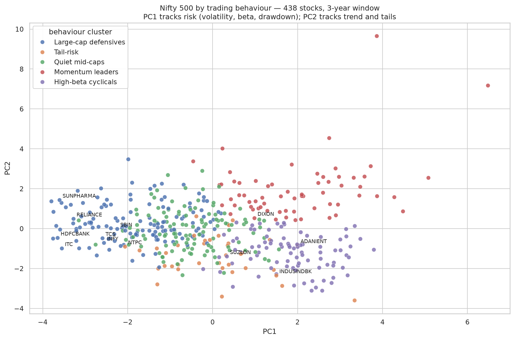
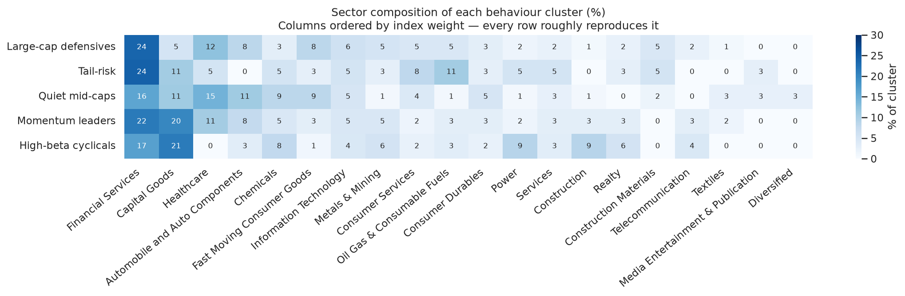

# Nifty 500 Behaviour Clusters

**An automated NSE market-data pipeline that maintains a half-million-row daily OHLCV dataset for the Nifty 500, and clusters those stocks by how they *behave* rather than by which sector they're labelled with.**

[](https://github.com/adityadeshmukh23/nifty500-behaviour-clusters/actions/workflows/daily_nse_pull.yml)
[](https://github.com/adityadeshmukh23/nifty500-behaviour-clusters/actions/workflows/tests.yml)
[](https://www.python.org/downloads/)
[](https://scikit-learn.org/)
[](https://www.kaggle.com/datasets/adityadeshmukh05/nifty500-daily-ohlcv)
[](LICENSE)

**Dataset on Kaggle →** https://www.kaggle.com/datasets/adityadeshmukh05/nifty500-daily-ohlcv
**Analysis →** [`01_feature_engineering.ipynb`](notebooks/01_feature_engineering.ipynb) · [`02_clustering.ipynb`](notebooks/02_clustering.ipynb)

---

## The question

Indian equities are conventionally grouped by GICS-style sector labels — "Financial Services", "Capital Goods", "IT". Those labels describe *what a company sells*, not *how its stock trades*. A small-cap NBFC and a large private bank sit in the same sector bucket while behaving nothing alike in volatility, drawdown depth, or momentum persistence.

So: **do stocks that trade alike belong to the same sector?**

Answering it needed two things that didn't exist — a clean, deep, reproducible NSE price history, and an automated way to keep it current. This repo is both: the pipeline that maintains the dataset, and the clustering built on top of it.

---

## Result



Five behaviour groups emerge from 438 stocks over the three years to 2026-09-04. They are contiguous regions of a continuum, not isolated islands — which is itself a finding, and the reason the notebook doesn't just take the argmax of a silhouette score.

| Cluster | n | Signature (cluster means) |
|---|---:|---|
| **Large-cap defensives** | 130 | lowest volatility (0.28), sub-1 beta, shallowest drawdowns, highest turnover — the index's ballast |
| **Quiet mid-caps** | 117 | low beta but thinly traded; move on their own news, not the market's |
| **High-beta cyclicals** | 89 | highest volatility (0.47) and beta (1.42), deepest drawdowns, and no trend to show for it |
| **Momentum leaders** | 65 | high volatility *with* a +66% mean 12-month return (median +56%) — the risk actually paid |
| **Tail-risk** | 37 | negative skew (-0.86) and kurtosis of 12: an ordinary tape punctuated by one severe crash |

**And the sector labels almost entirely fail to predict any of it.**



Financial Services is 20% of the index — and 16–24% of *every* behaviour cluster; no sector makes up more than a quarter of any of them. Capital Goods is the one that visibly leans: 13% of the index, but 5% of the defensives and 20–21% of the momentum and high-beta groups.

Quantitatively: **Adjusted Rand Index 0.013, Normalized Mutual Information 0.085.** A 1,000-run label-shuffling test puts the null ARI range at -0.007 to +0.010, so the association is real but *tiny* — about 1% of the way from random to identical.

The honest reading is not "sector and behaviour are independent" — the data rejects that — but **"sector explains almost none of how a stock trades."** The practical consequence: a portfolio spread across ten industries can still sit almost entirely inside the high-beta cyclical cluster and draw down like a single position. Behaviour has to be measured, not inferred from a sector column.

**The smell test it passes:** the Tail-risk group is defined by one property — a single severe crash session — and every one of its 37 members has one: a worst day of -13% to -34% on 1.4–52× normal volume. Eighteen of them share a date, 2024-06-04, the day the general-election result was declared, when mostly state-owned and Adani-group names lost 13–25% in one session; the rest are company-specific shocks — IndusInd Bank, Adani Enterprises, IEX, ZEEL, Cyient. Together they span 15 of the index's 20 sectors, and no sector label groups them.

---

## Dataset at a glance

| | |
|---|---|
| Rows | **~530k**, growing by about 500 each trading day |
| Symbols | **504** constituents (one, `JBCHEPHARM`, has had no data since 2026-07-23) |
| Coverage | **2022-01-03 → present** (daily bars, auto-updated) |
| Fields | `symbol, date, open, high, low, close, volume` |
| Prices | Split- and dividend-adjusted (`auto_adjust=True`); a symbol's history is re-downloaded when Yahoo re-adjusts it |
| Storage | Parquet, **~20 MB** — 62% smaller than the equivalent CSV (52 MB) |
| Source | Yahoo Finance via [`yfinance`](https://github.com/ranaroussi/yfinance) |
| Refresh | GitHub Actions, weekdays 18:30 IST (13:00 UTC) |

Per-symbol first date, last date and bar count are published in [`data/raw/coverage_report.csv`](data/raw/coverage_report.csv) and regenerated on every update. 420 of 504 symbols carry the full history; the rest are recent IPOs and demergers left short rather than forward-filled. Rows the source invents — sessions it has not finalised, market holidays padded with a stale close — are dropped rather than stored, so no synthetic prices enter the dataset.

---

## Method

**Universe.** A trailing 3-year window, keeping symbols present for ≥95% of sessions and still trading when the window ends — **438 of 504**. Three years supports a 12-month momentum feature and gives skew and kurtosis enough observations to mean something; the 66 excluded names are recent listings that re-enter automatically once they have the history. The trade-off is tabulated in notebook 01 rather than asserted.

**Cleaning.** Two layers. First, rows that were never real bars — sessions Yahoo had not finalised (a volume but no price) and market holidays padded with the previous close and zero volume — are dropped before anything is measured; otherwise the padded holidays sit in every stock's series as zero-return days. Second, ten sessions in the window are masked as corporate actions. Seven show single-day moves beyond ±40% — Vedanta's demerger, GPIL's bonus issue, ZF Commercial Vehicles' split — that `auto_adjust` missed. Three more (CONCOR, BRIGADE, TRENT) fell 21–33% on *below-normal* volume with no rebound: a real crash trades heavily on the day, a re-basing has no trading behind it, so a volume audit separates them. Those three are masked from a reviewed register, [`data/reference/corporate_actions.csv`](data/reference/corporate_actions.csv), that says "verify against NSE announcements" beside each. Left in, these few points define their stock's entire tail-behaviour feature. Masking them discards **0.003%** of observations and drops peak kurtosis from **328 to 43** while barely moving the median — the signature of removing artifacts, not signal. The masked sessions are divided out of the price path behind momentum and drawdown too, so all ten features agree on what a corporate action is.

**Features.** Ten, spanning axes a sector label doesn't capture:

| Feature | Captures |
|---|---|
| `ann_volatility` | overall risk level |
| `downside_volatility` | dispersion of losing days only |
| `beta` | market sensitivity, vs an equal-weight index built from the universe itself |
| `mom_3m`, `mom_6m`, `mom_12m` | trend persistence across horizons |
| `max_drawdown` | worst peak-to-trough loss |
| `return_skew`, `return_kurtosis` | asymmetry and fat tails |
| `log_turnover` | liquidity tier, logged because turnover spans orders of magnitude |

Beta comes out with a mean of exactly 1.00 — a built-in check that the market proxy is wired up correctly.

**Reduction.** Standardised, then PCA to 90% variance (**6 components, 92.3%**). Four of the ten features measure overlapping aspects of risk; without PCA, KMeans would weight risk four times as heavily as liquidity purely because it has more columns.

**Choosing k.** Silhouette peaks at k=2 and never exceeds ~0.25 — which describes a continuum, not separated blobs. Taking that argmax would mean splitting the index into "high beta" and "low beta" and calling it a result. So cluster count is checked against a **bootstrap stability curve** as well: re-cluster random 80% subsamples, score against the full-sample labels. Stability is 0.83 or better for every k from 2 to 6 and falls off a cliff at k=7 (0.56). Nothing in the diagnostics separates k=5 from k=6, so **k=5** is a judgment call in favour of descriptive resolution — the finest split whose groups the naming rules can tell apart (a sixth cluster is a moderate-momentum group they can only call "Quiet mid-caps (2)") — stated rather than buried.

---

## Architecture

```
                        ┌──────────────────────────────┐
                        │  GitHub Actions (cron)       │
                        │  weekdays 13:00 UTC          │
                        └──────────────┬───────────────┘
                                       │
                                       ▼
   ┌───────────────────────┐   ┌──────────────────────────────────┐
   │ nifty500_             │   │  scripts/fetch_daily.py          │
   │ constituents.csv      │──▶│  (logic: nifty500.ingest)        │
   │ (504 symbols +        │   │                                  │
   │  sector labels)       │   │  1. read master; drop rows       │
   └───────────────────────┘   │     that were never bars         │
                               │  2. yfinance: the last 7 days    │
                               │     held, plus anything new      │
                               │  3. empty reply, or >10% of      │
                               │     symbols lost → exit 1        │
                               │  4. prices re-adjusted           │
                               │     upstream → refetch history   │
                               │  5. merge; newest bar wins       │
                               └─────────────────┬────────────────┘
                                                 │
                           ┌─────────────────────┴────────────────┐
                           ▼                                      ▼
               ┌───────────────────────┐              ┌────────────────────────┐
               │ nifty500_ohlcv_raw    │              │  Kaggle dataset        │
               │ .parquet  (master)    │              │  (new version pushed)  │
               │ + coverage_report.csv │              └────────────────────────┘
               └───────────┬───────────┘
                           │
                           ├───────────▶ ┌──────────────────────────────┐
                           │             │ monitoring                   │
                           │             │                              │
                           │             │  a failed run opens (or      │
                           │             │  comments on) a              │
                           │             │  pipeline-failure issue;     │
                           │             │  the next success closes it  │
                           │             │                              │
                           │             │  check_freshness.py, on its  │
                           │             │  own cron: newest valid bar  │
                           │             │  older than 3 business days  │
                           │             │  → data-stale issue          │
                           │             └──────────────────────────────┘
                           ▼
               ┌──────────────────────────────────────────────┐
               │ nifty500.features    → 438 x 10 features     │
               │   clean bars → window select → mask          │
               │   corporate actions → vol / beta / momentum  │
               │   / drawdown / skew / kurtosis / turnover    │
               ├──────────────────────────────────────────────┤
               │ nifty500.clustering  → 5 behaviour clusters  │
               │   scale → PCA(90%) → k sweep (silhouette,    │
               │   bootstrap stability, ARI) → KMeans →       │
               │   rule-based naming → sector crosstab        │
               └──────────────────────────────────────────────┘
```

**Design decisions worth defending in review:**

- *Long format over wide.* A 504-column wide frame breaks whenever the index is rebalanced. Long format absorbs constituent changes without a schema migration — a symbol added to the constituents file is backfilled on the next run.
- *Parquet as the master, not a database.* Append-only, single-writer, read in full by the analysis — a columnar file beats the operational cost of hosting Postgres for this access pattern.
- *Overlap, don't append.* Every run re-fetches the last week of sessions it already holds. That overlap proves the upstream is alive (it is never legitimately empty, so an empty response is a failure, not a holiday), lets a final bar replace a provisional one, and exposes prices Yahoo has since re-adjusted for a split, bonus or dividend — for those symbols the whole history is re-downloaded, so the stored series never carries a seam at a corporate action.
- *De-duplication on the natural key, newest wins.* `(symbol, date)` uniqueness is enforced on our side rather than trusted, and on a clash the freshly fetched bar replaces the stored one. Keeping the first would make any bad row permanent.
- *A bar is defined once.* `nifty500.bars` decides what counts as a real trading bar; the pipeline, the freshness check and the analysis all filter through it. Anything an earlier run let in is shed on the next.
- *Logic in the package, network at the edge.* Everything that can go wrong is a pure function of DataFrames plus an injected downloader, so the failure modes are tests rather than folklore. `scripts/fetch_daily.py` only supplies yfinance and the file paths.
- *Market proxy built from the universe.* An equal-weight index computed from these same prices can't drift out of sync with the master the way an external benchmark file would.
- *Monitoring split in two.* Failure alerting watches the pipeline; the freshness check watches the data. They catch disjoint failure modes — a run that fails is loud, a run that stops happening or succeeds while writing nothing is silent — so neither alone is sufficient. Each raises its own labelled issue and clears it on recovery.
- *Cluster names derived by rule, not typed in.* Names come from each cluster's own profile, so they survive a re-run that permutes cluster ids, the two distinctive names are conditional (a 3-way split doesn't relabel its calmest group "Tail-risk" purely for being least calm), and they are always unique.
- *Reproducible by pinning.* The notebooks fix the end of the window (`AS_OF`), so the numbers above reproduce exactly — byte for byte, on Python 3.12 and 3.13 — even though the dataset has moved on since.

---

## Setup

**Requirements:** Python 3.12 or 3.13, [Git LFS](https://git-lfs.com) (the Parquet master is LFS-tracked). The exact dependency pins have wheels for those two versions only.

```bash
git lfs install
git clone https://github.com/adityadeshmukh23/nifty500-behaviour-clusters.git
cd nifty500-behaviour-clusters

python -m venv .venv && source .venv/bin/activate   # Windows: .venv\Scripts\activate
pip install -r requirements-analysis.txt            # also installs the package itself, editable
```

Reproduce the analysis end to end:

```bash
jupyter lab notebooks/       # run 01 then 02
pytest                       # feature, clustering, pipeline and freshness logic; no network, no LFS
ruff check .                 # lint
```

The notebooks are pinned to data through **2026-09-04** (`AS_OF` in notebook 01), so they reproduce the numbers in this README exactly. The dataset itself keeps growing; change `AS_OF` to roll the analysis forward.

Run the incremental data fetch:

```bash
pip install -r requirements.txt   # pipeline deps only
python scripts/fetch_daily.py
python scripts/fetch_daily.py --full-refresh   # re-download every symbol's whole history
```

The fetch is self-healing: running it repairs a master that an earlier run left with bad rows.

Load the dataset directly:

```python
import pandas as pd

df = pd.read_parquet("data/raw/nifty500_ohlcv_raw.parquet")
print(df.shape)                                  # about 530k rows x 7 columns
print(df["symbol"].nunique(), "symbols")         # 504 symbols

clusters = pd.read_csv("data/processed/clusters.csv", index_col="symbol")
print(clusters["cluster_name"].value_counts())
```

Prefer no clone, or out of Git LFS bandwidth? Pull the same data from Kaggle (and `GIT_LFS_SKIP_SMUDGE=1 git clone ...` fetches the code without the Parquet):

```bash
kaggle datasets download -d adityadeshmukh05/nifty500-daily-ohlcv
```

### Automation setup (optional)

The scheduled workflow needs two repository secrets under **Settings → Secrets and variables → Actions**:

| Secret | Purpose |
|---|---|
| `KAGGLE_USERNAME` | Kaggle account name |
| `KAGGLE_KEY` | Kaggle API token (`kaggle.json` → `key`) |

No credentials are stored in the repository; `kaggle.json`, `.env`, and `secrets/` are git-ignored.

Run **Daily NSE Pull** by hand from the Actions tab with *full_refresh* ticked to rebuild every symbol's history — the escape hatch for a re-adjustment older than the week the daily overlap covers.

---

## Repository structure

```
nifty500-behaviour-clusters/
├── .github/
│   ├── actions/alert-issue/        # composite: open/dedupe/close a tracking issue
│   └── workflows/
│       ├── daily_nse_pull.yml      # cron: fetch → commit → publish to Kaggle
│       ├── freshness.yml           # cron: assert the master has not gone stale
│       └── tests.yml               # lint + pytest (3.12, 3.13) on pushes to main and every PR
├── data/
│   ├── raw/
│   │   ├── nifty500_ohlcv_raw.parquet   # master dataset (LFS, ~20 MB)
│   │   ├── nifty500_constituents.csv    # 504 symbols + sector/industry/ISIN
│   │   ├── coverage_report.csv          # per-symbol first/last date + bar count
│   │   └── dataset-metadata.json        # Kaggle publishing manifest
│   ├── reference/
│   │   └── corporate_actions.csv        # sessions masked from the features, with evidence
│   └── processed/
│       ├── features.parquet             # 438 x 10 behavioural features
│       ├── clusters.csv                 # cluster assignment per symbol
│       └── cluster_profiles.csv         # mean feature vector per cluster
├── notebooks/
│   ├── 01_feature_engineering.ipynb     # window choice, cleaning, audit, features
│   └── 02_clustering.ipynb              # PCA, k selection, sector comparison
├── src/nifty500/                        # the installable package
│   ├── bars.py                          # what counts as a real OHLCV bar
│   ├── ingest.py                        # incremental, self-healing refresh logic
│   ├── coverage.py                      # per-symbol coverage report
│   ├── freshness.py                     # staleness check
│   ├── features.py                      # OHLCV → behavioural features
│   └── clustering.py                    # PCA, k diagnostics, naming
├── scripts/
│   ├── fetch_daily.py                   # yfinance + file paths around nifty500.ingest
│   └── check_freshness.py               # staleness backstop
├── tests/
│   ├── fake_yahoo.py                    # a steerable stand-in for yfinance
│   ├── test_bars.py                     # unpriced and placeholder rows
│   ├── test_ingest.py                   # the refresh, replayed against fake_yahoo
│   ├── test_fetch_cli.py                # the script end to end, files in and out
│   ├── test_coverage.py                 # coverage report
│   ├── test_freshness.py                # staleness calendar edges
│   ├── test_features.py                 # feature math on known price paths
│   ├── test_clustering.py               # reduction, stability, naming rules
│   ├── test_artifacts.py                # committed outputs agree with each other and this README
│   └── test_notebooks.py                # notebooks ran cleanly, in order, on the date they pin
├── docs/                                # generated figures
├── pyproject.toml                       # package metadata, pytest and ruff config
├── requirements.txt                     # pipeline runtime, pinned
├── requirements-analysis.txt            # notebooks, tests and lint, pinned
├── LICENSE
└── README.md
```

---

## What I learned

**Git LFS pointers are not files, and CI doesn't know that.** The scheduled job reads the master Parquet on every run. `actions/checkout` fetches LFS *pointers* by default — 133-byte text stubs — so `pd.read_parquet` was handed a stub and every scheduled run failed. The fix is one line (`lfs: true`), but finding it meant learning that a green local run and a green CI run test genuinely different filesystems.

**A green build is not a working build.** Fixing the checkout turned the badge green — and the job still fetched nothing, because the pinned `yfinance` was too old to talk to the current Yahoo API and the script reported the empty result as "likely a market holiday". Exit code 0 was lying. The real fix was making failure *loud*: an empty response or a >10% symbol miss now exits non-zero. A pipeline that cannot fail visibly cannot be trusted when it succeeds.

**A guard can guard the wrong thing.** Every scheduled run was green, yet the commit log showed data landing only every other weekday. The script asked "is the next day I need today?" and, running in the evening after the close, said yes on every second run and exited 0 with "already up to date". It is the same failure as the fifty red runs, one level down. The fix was to stop reasoning about which day to fetch: every run re-fetches an overlap, and an empty overlap is an error.

**Rows that look like data.** yfinance drops a row only when every column is empty, so a session Yahoo had not finalised (a volume but no price) and market holidays padded with the previous close both went straight into the master: 503 unpriced rows on one date, five fake sessions, thousands of zero-volume placeholders. Starting each run at `last_date + 1` and keeping the *first* row on a clash meant none of it could ever be corrected. A bar is now defined in one place, everything filters through it, and the newest fetch wins.

**Alerting on failure is only half of monitoring.** After the pipeline had failed 50 times unnoticed, the obvious fix was to alert on failure — open an issue naming the failing step, close it on recovery. But that only fires when a run *fails*, and the outage's real shape was runs that stopped mattering: a schedule disabled after inactivity, or a job going green while writing nothing. So a second check asserts freshness against the data itself — is the newest valid bar within three business days? — and catches exactly the cases the first one structurally cannot see. I tested both by pushing deliberately broken branches, because an untested alert is just another thing that fails silently.

**The metric is not the answer.** Silhouette peaked at k=2 and would have "chosen" a two-way high-beta/low-beta split. Its absolute value (~0.2) was the more informative number: it said the data is a continuum, so *no* k is truly right and the real job is picking a resolution that reproduces under resampling. Reporting the sweep and the reasoning is more defensible than reporting an argmax.

**Fourth moments are hostage to single data points.** Ten observations out of 323,401 — 0.003% — were setting peak kurtosis at 328. Unadjusted corporate actions don't look like outliers in a price chart; they look like a stock that lost 80% in a day. Any feature built on higher moments needs an artifact check before it means anything.

**A small cluster is a statement about its outliers.** The first version of this analysis reported an 11-stock Tail-risk group that passed its own smell test. Auditing the extreme sessions showed two of its members, CONCOR and TRENT, had "crashed" on days with no trading volume behind them, at price ratios that sit on the 4/5 and 2/3 of a bonus issue. They were corporate actions that walked under the 40% mask, and their extreme kurtosis was inflating the scaler's variance and squeezing every other stock's tail features toward zero. With them masked, the group grew to 37 names, every one with a real crash session on real volume. The smallest cluster of a continuum is where the data's dirt collects.

**Tests found a design bug, not just a typo.** Writing a case for k=3 crashed the cluster-naming rule, which had quietly assumed at least five clusters. Fixing the crash surfaced the deeper flaw: the rule handed out "Tail-risk" unconditionally, so in a 3-way split it would label the *calmest* group tail-risky for merely being least calm. The names are now conditional on a cluster actually showing the trait. A later case found the mirror image: when no cluster qualified, three clusters were all called "Quiet mid-caps" and a crosstab keyed on the name merged them into one row. Names are now always unique.

**Committing a growing binary is a design decision with a bill attached.** Appending to a ~20 MB Parquet and committing it daily writes a new full copy into history every weekday — several GB of LFS storage a year for a few kilobytes of new prices. The pipeline now commits only when the data actually changed, so a holiday costs nothing, but a trading day still does.

---

## Roadmap

- [ ] Cluster stability across rolling windows — does membership persist through regime changes?
- [ ] Extend history to 2015 for a full market-cycle view
- [ ] Corporate-action audit against NSE bhavcopy, rather than threshold masking plus a reviewed register
- [ ] Robust scaling (or winsorised kurtosis), so a handful of extreme values cannot move the smallest cluster
- [ ] Point-in-time index constituents, to remove survivorship bias
- [ ] Compare KMeans against HDBSCAN, which doesn't assume spherical clusters

---

## Limitations

- Features are measured over one 3-year window containing one market regime; membership would shift in another period.
- 66 recent listings are excluded for lack of history, so the newest and often most volatile corner of the index is under-represented.
- The universe is a snapshot of the constituents file, so it carries survivorship bias: stocks that left the index before it was taken are not in the history. Delisted names stay in the file until it is refreshed and are tolerated rather than failed.
- Corporate actions under the 40% threshold are found by review, not by an exchange feed. The register lists three, each marked "verify"; others may remain.
- The daily overlap catches a re-adjustment that arrives after a symbol's last stored bar. A correction Yahoo makes to older history — or a seam left by the append-only pipeline that ran before this one — needs a manual `--full-refresh`.
- `log_turnover` multiplies adjusted prices by unadjusted volume, so for the few symbols with a split inside the window it is mis-scaled before the split; the median across ~740 sessions mutes that but does not remove it.
- KMeans imposes spherical clusters. Given the silhouette analysis, the boundaries are conveniences rather than discoveries.

---

## Licence & disclaimer

Code released under the [MIT Licence](LICENSE). The dataset is published on Kaggle under CC0-1.0.

Price data is sourced from Yahoo Finance and is provided as-is for research and education; Yahoo Finance's terms of use govern the underlying data. **This is not investment advice.**
